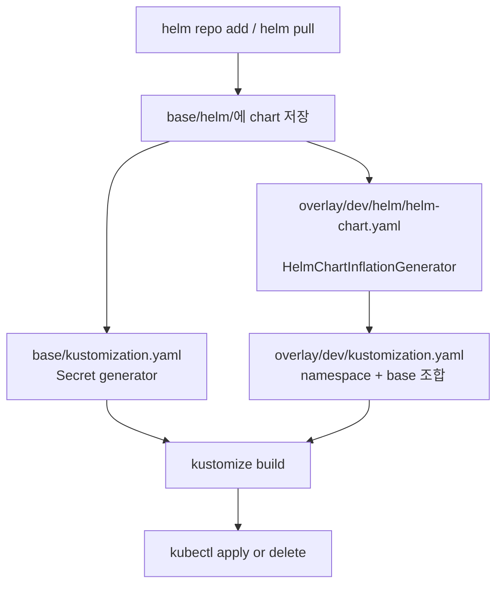

# Helm + Kustomize 배포 표준과 재사용 지침

## 목적
이 문서는 `platform/<tool>` 계열의 Helm 기반 툴을 동일한 방식으로 배포할 수 있도록, 공통 아키텍처와 운영 규칙을 정리한다.

핵심 원칙은 다음 세 가지다.

1. Helm은 애플리케이션 리소스 생성 책임을 가진다.
2. Kustomize는 환경별 오버레이와 공통 리소스 주입 책임을 가진다.
3. 민감정보, 네임스페이스, 환경별 값은 base와 overlay로 분리한다.

## 표준 배포 구조

### 디렉터리 역할
- platform/<tool>/Makefile: chart pull, 렌더링, apply/delete를 실행하는 진입점이다.
- platform/<tool>/kustomize/base/kustomization.yaml: 공통 리소스를 정의한다.
- platform/<tool>/kustomize/base/helm/<chart-name>: upstream Helm chart를 로컬에 vendoring한 결과물이다.
- platform/<tool>/kustomize/overlays/dev/kustomization.yaml: 배포 네임스페이스와 base 조합을 정의한다.
- platform/<tool>/kustomize/overlays/dev/helm/helm-chart.yaml: HelmChartInflationGenerator로 chart를 Kustomize 입력으로 변환한다.
- platform/<tool>/kustomize/overlays/dev/helm/values.yaml: 환경별 Helm values 파일이다.

### 실제 배포 흐름


### 동작 방식
1. `make pull` 또는 동등한 작업이 upstream chart를 내려받아 `kustomize/base/helm/<chart-name>` 아래에 저장한다.
2. `base`는 공통 리소스만 가진다. Secret, ConfigMap, PVC, RBAC, ServiceAccount 같은 리소스는 이 계층에서 관리한다.
3. `overlay/dev`는 `namespace: <namespace>`를 선언하고, HelmChartInflationGenerator로 chart를 렌더링한다.
4. Helm 렌더링 결과와 base 리소스가 `kustomize build`에서 합쳐진다.
5. 최종 출력은 `kubectl apply --server-side --force-conflicts` 또는 `kubectl delete`로 반영된다.

## 설계 포인트

### 1. Helm chart는 repo 밖에서 직접 배포하지 않는다
차트를 직접 `helm install`하지 않고, chart를 repo 내부 `base/helm`으로 vendoring한 뒤 Kustomize가 감싸는 구조를 표준으로 삼는다. 이 방식은 다음 장점이 있다.
- 차트 버전을 코드 저장소에 고정할 수 있다.
- 배포 시점마다 같은 렌더링 결과를 재현하기 쉽다.
- overlay에서 values만 바꿔 환경별 차이를 관리할 수 있다.

### 2. 민감정보는 Helm values가 아니라 Kustomize secretGenerator로 관리한다
root 계정, API key, 토큰, 외부 시스템 인증정보는 values에 평문으로 두지 않고 Secret으로 분리한다. 이 패턴은 다른 Helm 기반 툴에도 그대로 적용하는 것이 좋다.

### 3. 환경별 차이는 overlay values 파일로 분리한다
`values-dev.yaml`, `values-prod.yaml`처럼 환경 기준값을 overlay에 두고, 공통 chart는 base에 유지한다. 이렇게 하면 환경별 차이와 차트 원본이 섞이지 않는다.

### 4. namespace는 단일 기준으로 통일한다
- 원칙: chart 렌더링 namespace, overlay namespace, kubectl 적용 namespace를 하나로 맞춘다.
- 권장: namespace 값은 overlay와 Makefile에서 동일한 상수로 관리한다.

## 플랫폼 공통 표준 패턴

아래 구조를 새 툴에도 그대로 복제하면 된다.

```text
platform/<tool>/
  Makefile
  kustomize/
    base/
      kustomization.yaml
      helm/
        <chart-name>/
    overlays/
      dev/
        kustomization.yaml
        helm/
          helm-chart.yaml
          values-dev.yaml
      prod/
        kustomization.yaml
        helm/
          helm-chart.yaml
          values-prod.yaml
```

### base에서 관리할 것
- upstream chart를 vendoring한 파일
- 공통 ConfigMap, Secret, PVC, RBAC, ServiceAccount
- 환경과 무관한 네임스페이스 외 기본 리소스

### overlay에서 관리할 것
- namespace
- values 파일
- ingress host, TLS secret name, replica 수, storage class, resources
- 환경별 Secret 이름 참조
- CRD 포함 여부가 필요하면 `includeCRDs: true`

### Makefile에서 제공할 타깃
- `pull`: chart 업데이트
- `preview`: 렌더링 결과 확인
- `apply`: 실제 반영
- `delete`: 제거
- `help`: 사용법 안내

### HelmChartInflationGenerator 사용 원칙
- `chartHome`은 vendored chart의 상위 디렉터리를 가리킨다.
- `chart`는 chart 폴더 이름과 일치해야 한다.
- `releaseName`은 리소스 이름 안정성을 위해 고정한다.
- `valuesFile`은 overlay 내부 파일만 바라보게 한다.
- `namespace`는 overlay의 namespace와 반드시 동일해야 한다.

## 새 Helm 기반 툴 도입 체크리스트

1. chart를 직접 설치할지, vendoring 후 Kustomize로 감쌀지 먼저 결정한다. 이 저장소의 표준은 vendoring + Kustomize다.
2. 민감정보는 Secret generator 또는 외부 Secret 참조로 분리한다.
3. base에는 공통 리소스만 두고, 환경별 차이는 overlay values로 옮긴다.
4. namespace를 한 곳에서만 정의한다.
5. `kustomize build` 결과가 `kubectl apply` 가능한지 먼저 검증한다.
6. 차트 버전과 values 변경 이력을 함께 관리한다.
7. 운영에 필요한 ingress, storage, resources, securityContext를 values에서 명시적으로 고정한다.

## 권장 운영 규칙
- chart 버전은 자주 바꾸지 말고, 변경 시 `pull` 결과를 리뷰한다.
- values 파일은 환경별로 나눈다. 예: `values-dev.yaml`, `values-prod.yaml`.
- Secret 이름, TLS secret 이름, ingress host는 환경마다 분리한다.
- 모든 배포는 `kustomize build`를 거쳐야 한다.
- 직접 `helm install`을 표준 경로로 두지 않는다.

## 요약
Helm 기반 툴은 다음 구조로 배포하는 것을 표준으로 삼는다.
- Helm chart는 `base/helm`에 vendoring한다.
- 공통 리소스는 Kustomize generator 또는 base 리소스로 만든다.
- overlay에서 namespace와 values를 주입한다.
- 최종 apply/delete는 `kustomize build | kubectl` 파이프로 수행한다.

이 패턴을 그대로 복제하면, 이후 추가되는 Helm 기반 툴도 동일한 운영 규칙으로 관리할 수 있다.

## 예시
현재 `platform/minio`는 위 표준의 한 구현 예시다.
- `platform/minio/kustomize/base`는 공통 Secret을 만든다.
- `platform/minio/kustomize/overlays/dev`는 namespace와 Helm values를 주입한다.
- `platform/minio/Makefile`은 pull, preview, apply, delete 진입점을 제공한다.
